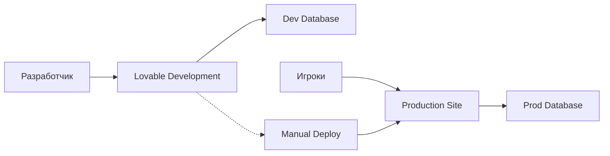

# Production Environment Setup Guide

## Настройка Production окружения

### 🎯 Цель
Создать отдельную продакшн базу данных, чтобы изменения в Lovable не влияли на основную игру игроков.

### 📋 Шаги настройки

#### 1. Создать новый Supabase проект
1. Зайди в [Supabase Dashboard](https://supabase.com/dashboard)
2. Нажми "New Project"
3. Назови проект (например: "elves-dragons-prod")
4. Выбери регион и план
5. Сохрани новые credentials:
   - Project URL: `https://your-new-project.supabase.co`
   - Anon Key: `eyJ...` (новый ключ)

#### 2. Скопировать схему БД
В SQL Editor старого проекта выполни:

```sql
-- Создать дамп всех таблиц
SELECT 
  'CREATE TABLE ' || schemaname||'.'||tablename || ' (' ||
  array_to_string(
    array_agg(column_name ||' '|| data_type ||
    case 
      when character_maximum_length is not null 
      then '('||character_maximum_length||')' 
      else '' end ||
    case when is_nullable = 'NO' then ' NOT NULL' else '' end
    ), ', ') || ');'
FROM information_schema.columns 
WHERE table_schema = 'public'
GROUP BY schemaname, tablename;
```

#### 3. Скопировать функции
```sql
-- Получить все функции
SELECT 
  'CREATE OR REPLACE FUNCTION ' || routine_name || '(' ||
  COALESCE(
    (SELECT string_agg(parameter_name || ' ' || data_type, ', ')
     FROM information_schema.parameters 
     WHERE specific_name = r.specific_name), 
    ''
  ) || ') RETURNS ' || data_type || ' AS $' || '$' ||
  routine_definition || '$' || '$ LANGUAGE ' || external_language || ';'
FROM information_schema.routines r
WHERE routine_schema = 'public';
```

#### 4. Скопировать RLS политики
```sql
-- Получить все политики
SELECT 
  'CREATE POLICY "' || policyname || '" ON ' || schemaname || '.' || tablename ||
  ' FOR ' || cmd || 
  CASE WHEN permissive = 'PERMISSIVE' THEN '' ELSE ' RESTRICTIVE' END ||
  CASE WHEN roles IS NOT NULL THEN ' TO ' || array_to_string(roles, ', ') ELSE '' END ||
  CASE WHEN qual IS NOT NULL THEN ' USING (' || qual || ')' ELSE '' END ||
  CASE WHEN with_check IS NOT NULL THEN ' WITH CHECK (' || with_check || ')' ELSE '' END || ';'
FROM pg_policies 
WHERE schemaname = 'public';
```

#### 5. Обновить конфигурацию
В файле `src/config/environment.ts` замени:

```typescript
// Production (replace with your new project credentials)
const PRODUCTION_CONFIG: SupabaseConfig = {
  url: "https://YOUR_NEW_PROJECT.supabase.co", // 👈 Твой новый URL
  anonKey: "YOUR_NEW_ANON_KEY" // 👈 Твой новый ключ
};
```

#### 6. Настроить домен для продакшн
В том же файле обнови:

```typescript
// Check for production domain
if (window.location.hostname === 'yourgame.com') { // 👈 Твой домен
  return 'production';
}
```

### 🚀 Процесс деплоя

#### Development → Production
1. **Тестируй в Lovable** (development окружение)
2. **Экспортируй код** когда готов к релизу
3. **Деплой на продакшн** сервер/хостинг
4. **Игроки видят обновления** только после деплоя

### 🔧 Проверка статуса

Добавил компонент `EnvironmentSwitcher` для мониторинга:
- Показывает текущее окружение
- Отображает URL базы данных  
- Предупреждает о production режиме

### 📊 Результат



### ⚠️ Важно

- **Development**: Все изменения в Lovable влияют только на dev БД
- **Production**: Игроки играют в стабильной версии
- **Deploy Control**: Ты контролируешь когда обновления попадают к игрокам
- **Data Safety**: Данные игроков защищены от случайных изменений

### 🎮 Что получаем

✅ Безопасная разработка в Lovable  
✅ Стабильная игра для пользователей  
✅ Контролируемые обновления  
✅ Раздельные базы данных  
✅ Тестирование без рисков  

### 🔗 Полезные ссылки

- [Development DB](https://supabase.com/dashboard/project/oimhwdymghkwxznjarkv)
- [Production DB](https://supabase.com/dashboard/project/YOUR_PROD_PROJECT) ← После создания